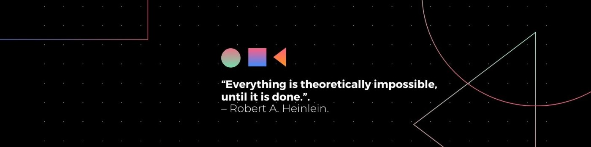

  

 

<h1 align="center">Hi 👋, I'm Alperen Eroğlu</h1>

I am a young electrical and electronics engineer 👨‍💻 is eager to learn 🤓, has high working energy 💪, is strong in human relations 👌, is suitable for teamwork ✍️, and is social 🙋‍♂️.

I worked with various subjects such as software, embedded systems, microcontrollers, circuit board design and drawing, web development and image processing.

In my professional life, I aim to gain experience especially in embedded systems. I also aim to gain experience in image processing. I want to work selflessly in positions where I can gain experience in line with my goals.

  

<h3 align="left">Connect with me:</h3>

<h3 align="left">View My Resume:</h3>

<h3 align="left">Languages and Tools:</h3>

                             

## Support Me

You can support me on BuyMeACoffee!

